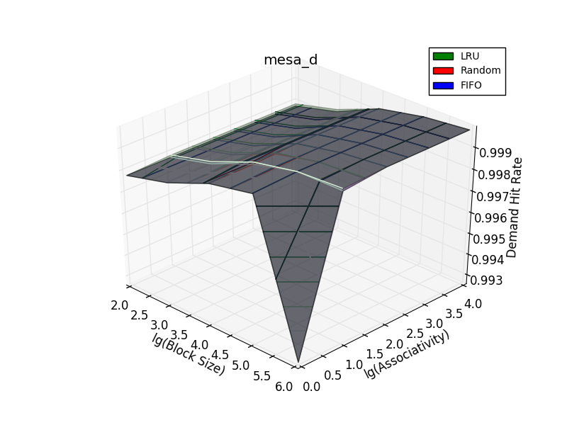
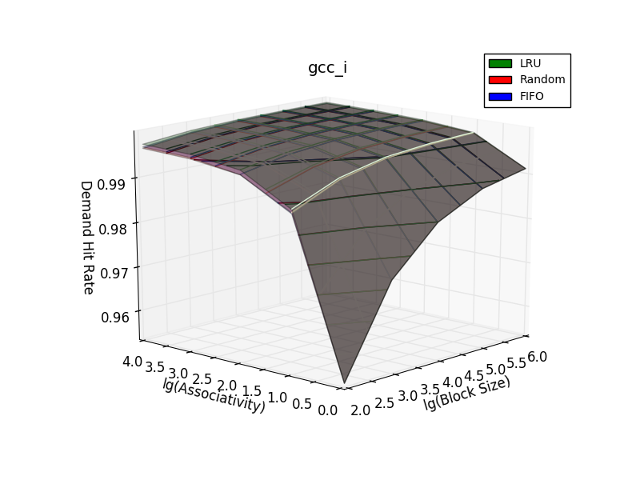

Relatório Exercício 2
=======================

## Introdução

## Objetivos
Este exercício tem como objetivo avaliar o desempenho de 1 nível de cache de dados e instrução em traces de execução disponibilizados de 4 benchmarks considerando os seguintes parâmetros:
- Tamanho total da Cache
- Tamanho do Bloco (Linha da Tabela)
- Associatividade (Conjuntos)
- Política de Substituição

## Procedimento

Para evitar explosão combinatória seguiu-se o seguinte procedimento:

1. Fixou-se os valores de tamnhos de blocos, associatividade e Política de Substituição em todos os banchmarks e variou-se o tamanho das caches L1 de dados (L1d) e de instruções (L1i).
2. Encontra-se o melhor valor para o tamanho das caches
3. Com os melhores tamanhos fixados, varia-se os outros parâmetros de forma a obter a melhor combinação.

## Tamanhos de cache avaliados

Primeiramente, avaliou-se com apenas 10 traces todas as possíveis combinações de tamanhos para caches L1i e L1d.

Obtendo assim os gráficos mostrados a seguir:

Como pode ser observado os tamanhos de L1i não influenciam na tacha de Misses de L1d e vice-versa.

Assim pode-se considerar apenas os casos em que size(L1i) == size(L1d).

Assim, executa-se uma análise mais detalhada, dessa vez com 100 traces somente para os casos em que os tamanhos de ambas as caches são iguais.

Para facilitar a visualização plotou-se a derivada numérica aproximada desses gráficos, como podes ser visto a seguir:

Definiu-se (64K 32K 8K 4K) para (gcc, mesa, galgel, art) usando como critério3 variações na taxa e procurou-se obter o valor que maximiza a variação com relação ao anterior e minimiza a variação com relação ao próximo. E toma-se o primeiro tamanho que atende a este critério entre as caches de dados e instruções.

Fixado o tamanho da cache, agora varia-se os outros parâmentros:
- Tamanho do Bloco (Linha)
- Associatividade (Número de Conjuntos)
- Política de Substituição

Assim, obtêm-se os seguintes gráficos para L1d:

Neste gráfico pode-se observar que a Política de Substiuição LRU (Least Recent Used) é a que se sai melhor comparada as outras já que apresenta uma taxa de hit maior. Também é possível perceber que o tamanho do bloco parece influenciar mais que a associatividade.

Neste gráfico pode-se observar que as políticas de substituição não parecem ser tão determinantes. Mas o mais interessante é a queda,mesmo que pequena em números absolutos da taxa de hit quando o tamanho do bloco é grande mas a associatividade é baixa. O que mostra a importância de a associatividade exisitir

Neste gráfico é interessante notar que com blocos pequenos, a política de substituição influencia bastante no desempenho. Outra observação é que o desempenho parece depender mais do tamanho do bloco do que da associatividade.

Neste gráfico é interessante notar como o desempenho parece depender quase que exclusivamente do tamanho do bloco, aumentando o hit conforme o aumento do tamanho, como esperado.

Em todos os casos onde há diferença significativa de desempenho considerando apenas as políticas de substituição, a random geralmente é a pior alternativa, como esperado. Entretanto está política é mais fácil de implementar, já que não é necessário guardar o estado de acessos recentes.

Outra observação relevante é que a diferença entre as políticas de substituição se torna maior com o aumento da associatividade, o que é bem razoável já que se não houver associatividade, não há opções para a substituição e portanto as políticas adotadas são irrelevantes.

Já para L1i:

Em todos os gráficos em que

## Tamanhos de bloco avaliados

## Associatividade

## Outras configurações avaliadas

## Interpretação dos Resultados
