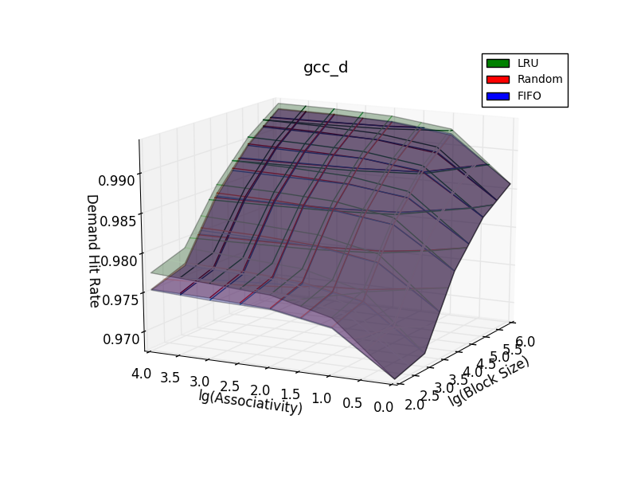
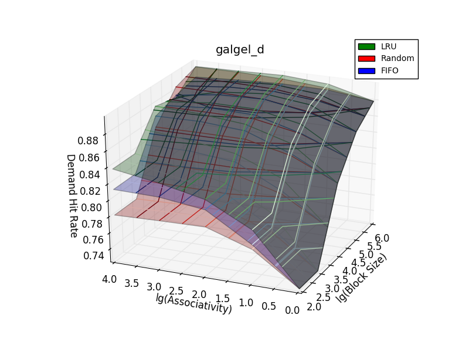

Relatório Exercício 2
=======================

## Introdução

## Objetivos
Este exercício tem como objetivo avaliar o desempenho de 1 nível de cache de dados e instrução em traces de execução disponibilizados de 4 benchmarks considerando os seguintes parâmetros:
- Tamanho total da Cache
- Tamanho do Bloco (Linha da Tabela)
- Associatividade (Conjuntos)
- Política de Substituição

## Procedimento

Para evitar explosão combinatória seguiu-se o seguinte procedimento:

1. Fixou-se os valores de tamnhos de blocos, associatividade e Política de Substituição em todos os banchmarks e variou-se o tamanho das caches L1 de dados (L1d) e de instruções (L1i).
2. Encontra-se o melhor valor para o tamanho das caches
3. Com os melhores tamanhos fixados, varia-se os outros parâmetros de forma a obter a melhor combinação.

## Tamanhos de Cache Avaliados

Primeiramente, avaliou-se com apenas 10 traces todas as possíveis combinações de tamanhos para caches L1i e L1d.

Obtendo assim os gráficos mostrados a seguir:

Como pode ser observado os tamanhos de L1i não influenciam na tacha de Misses de L1d e vice-versa.

Assim pode-se considerar apenas os casos em que size(L1i) == size(L1d).

Assim, executa-se uma análise mais detalhada, dessa vez com 100 traces somente para os casos em que os tamanhos de ambas as caches são iguais.

Para facilitar a visualização plotou-se a derivada numérica aproximada desses gráficos, como podes ser visto a seguir:

Definiu-se (64K 32K 8K 4K) para (gcc, mesa, galgel, art) usando como critério3 variações na taxa e procurou-se obter o valor que maximiza a variação com relação ao anterior e minimiza a variação com relação ao próximo. E toma-se o primeiro tamanho que atende a este critério entre as caches de dados e instruções.

## Análise dos Outros Parâmetros

Fixado o tamanho da cache, agora varia-se os outros parâmentros:
- Tamanho do Bloco (Linha)
- Associatividade (Número de Conjuntos)
- Política de Substituição

Sabendo o tempo que demorou as primeiras execuções e considerando a quantidade de parâmetros sendo avaliados dessa vez, limitou-se o número máximo de traces para 20. Obtêm-se assim, dados suficientes para os seguintes gráficos:

### L1d
No caso de L1d, notou-se que em todos os casos onde há diferença significativa de desempenho considerando apenas as políticas de substituição, a random geralmente é a pior alternativa, como esperado. Entretanto esta política é mais fácil de implementar e portanto mais barata, já que não é necessário guardar o estado de acessos recentes.

Outra observação relevante é que a diferença entre as políticas de substituição se torna maior com o aumento da associatividade, o que é bem razoável já que se não houver associatividade, não há opções para a substituição e portanto as políticas adotadas são irrelevantes e quanto mais associatividade mais opções há e portanto maior espaço para divergência.

Neste gráfico pode-se observar que a Política de Substiuição LRU (Least Recent Used) é a que se sai melhor comparada as outras já que apresenta uma taxa de hit maior. Também é possível perceber que o tamanho do bloco parece influenciar mais que a associatividade.

Neste gráfico pode-se observar que as políticas de substituição não parecem ser tão determinantes. Mas o mais interessante é a queda,mesmo que pequena em números absolutos da taxa de hit quando o tamanho do bloco é grande mas a associatividade é baixa. O que mostra a importância de a associatividade exisitir

Neste gráfico é interessante notar que com blocos pequenos, a política de substituição influencia bastante no desempenho. Outra observação é que o desempenho parece depender mais do tamanho do bloco do que da associatividade.

Neste gráfico é interessante notar como o desempenho parece depender quase que exclusivamente do tamanho do bloco, aumentando o hit conforme o aumento do tamanho, como esperado.

###L1i

Já para L1i, a primeira observação interessante é que a quantidade de hits depender menos da associatividade que do tamanho do bloco, consequentemente a divergência quanto a política de substituição é quase nula em todos os casos, o que é razoável considerando que a maior parte dos códigos executa sequencialmente.

Este é o gráfico que apresenta um desempenho mais simétrico em relação ao tamanho do bloco e a associatividade, consequentemente também é o que apresenta a maior divergência encontrada quanto a política de substituição

Neste gráfico verifica-se claramente que uma associatividade maior que 2^1 = 2 não traz nenhum desempenho a este benchamrk, já que para valores maiores a taxa de hits continua 1 invariavelmente.

Similar ao anterior.

Este gráfico também mostra que a taxa de hits da cache chega ao limite para valores de bloco maiores que 2^3 = 8 bytes e de associatividade maiores que 2^1 = 2 caches paralelas.

## Os Melhores Parâmetros
Dos gráficos acima é possível inferir que a melhor política de substituição é a LRU, pois sempre que há diferença siginificativa entre as políticas, a LRU tem maior taxa de Hit, já que aparece por cima nos gráficos quase sempre.

Com isso determinado, executou-se os testes novamente, dessa vez com 100 traces, mas apenas com a LRU como política de substituição.

Para fascilitar encontrar os melhores valores, plotou-se os valores em heatmaps e em histogramas onde o eixo x tem todas as combinações de lg(assocaitividade) e lg(tamanho do bloco), pois assim é possível visualizar ao mesmo tempo a taxa de hits e com quais parâmetros essa taxa foi atingida.

Também plotou-se a norma do gradiente desta função, para visualizar as taxas de mudança. Os gráficos são exibidos a seguir:

Este gráfico permite concluir que o desempenho para L1d é praticamente independente do tamanho do bloco, então escolhe-se o menor tamanho de bloco possível: 2^2 = 4 bytes.
Para L1i o mesmo ocorre em uma escala menore mais próxima da taxa de Hits máxima.

Outra forma de visuzlizar a mesma coisa seria através do seguinte gráfico:

A partir deste gráfico é possível perceber que a maior mudança de valor ocorre com associatividade 2^2 = 4, assim considera-se 2^3 = 8 como o melhor valor, já que este tem a melhor melhora na taxa de hits em relação aos anteriores.

Neste caso, nenhum dos parâmetros é independente dos outros, assim o critério deve ser o primeiro onde a variação dimnui de maneira significativa de forma a minimizar ambos os parâmetros. Ao mesmo tempo deve-se considerar que toda a mudança possível neste caso está dentro de uma janela de 4%.

Semelhante ao que se conluiu no anterior, a taxa de hits de L1d parece não depender da associatividade. Assim, escolhe-se como melhor o valor o menor possível, isto é 2^0 = 1 de associatividade. Para L1i escolhe-se 2^1 = 2, porque a melhora se estaviliza aí

Considerando a mudança a seguir conclui-se que o melhor valor para L1d é 2^3 = 8bytes pelos critérios já apresentados:

Usando um procedimento semelhante ao mostrado nos dois casos anteriores para os gráficos a seguir, determinou-se os melhores valores como:

Aqui o desempenho para L1i é independente de ambos os parâmetros, assim qualquer escolha é válida, querendo minmizar o valor dos parâmetros por questões de custo de implementação escolhe-se o menor possível para L1i: 4bytes de bloco e associatividade 1.
Para L1d novamente é preciso considerar a taxa de mudança, isto é o gradiente, ou seja:

Assim é possível observar que para 2^4 = 16 bytes e associatividade 2^0=1, o gráfico assume um mínimo e como pode ser visto no gráfico acima, este valor é um dos melhores dentro do intervalo analisado

Neste grafo, de forma semelhante aos anteriores a L1i já assume desempenho ótimo para o mínimo (igual aos casos anteriores)
A análise de L1d é idêntica a do gcc, inclusive os gradientes são muito semelhantes como pode ser verificado:

