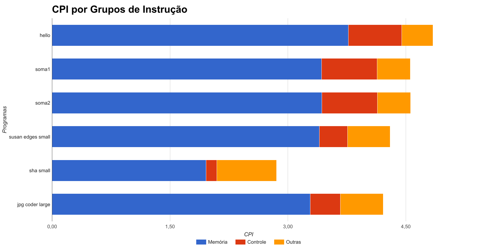

**Nome**: Lucas Alves Racoci  **RA**: 156331
Exercício 3
===========
## Introdução

Os tipos de métricas válidos para avaliação do desempenho são os que melhor se adequam ao problema, se o objetivo for estabelecer uma métrica global, a melhor é a que se aplica a maioria dos casos, o que se relaciona com a máxima:

    " Make the Common Case Fast "

Uma forma de medir o desempenho de um programa que está sendo executado dentro de um simulador é usando algum parâmetro que seja comum tanto ao simulador quanto a um ambiente de execução real. Neste caso será usado o número de instruções execultadas de cada tipo.

Exceto nos casos onde o caso mais comum é a execução em simuladores, de forma geral, o tempo de execução do simulador não é relevante para avaliar o desempenho do sistema.

O desempenho de um sistema computacional pode ser medido através de diversos critérios, no caso de uma únidade de processamento, pode-se usar critérios como:

 - Tempo de resposta
 - Tempo de Execução
 - Throughput

Neste exercício haverá uma contagem do número de instruções e, usando uma estimativa do CPI médio de cada tipo de instrução, será calculada a quantidade de ciclos executados por instrução (CPI).


Neste exercício haverá uma contagem do número de instruções e, usando uma estimativa do CPI médio de cada tipo de instrução, será calculada a quantidade de ciclos executados por instrução (CPI).

## Objetivo
Este exercício tem como objetivos:

- Aprender noções básicas do ambiente de simulação ArchC.
- Relembrar conceitos sobre medida de desempenho, em especial CPI.
- Avaliar o desempenho de um processador baseado no tempo de execução de um conjunto de programas.

## Procedimento, Resultados e Análise

Realizou-se o procedimento conforme indicado no [enunciado](http://www.ic.unicamp.br/~lucas/teaching/mc723/2017-1/ex3.html).

### Pré Atividade
Para se acostumar com o ambiente de simulação do MIPS, primeiramente foi escrito o clássico Hello World em **c** para ser compilado e execultado no simulador.
O programa ficou assim:
```c
#include <stdio.h>
int main(){
	printf("Hello World !!!!1!onze!11!!\n");
	return 0;
}
```
Depois disso, o programa foi compilado e executado, gerando a resposta:

```
$ ./mips.x --load=hello.mips                            

        SystemC 2.3.1-Accellera --- Apr  3 2017 02:27:47
        Copyright (c) 1996-2014 by all Contributors,
        ALL RIGHTS RESERVED
ArchC: Reading ELF application file: hello.mips

ArchC: -------------------- Starting Simulation --------------------

Hello World !!!!1!onze!11!!

ArchC: -------------------- Simulation Finished --------------------

Info: /OSCI/SystemC: Simulation stopped by user.
ArchC: Simulation statistics
    Times: 0.00 user, 0.00 system, 0.01 real
    Number of instructions executed: 2920
    Simulation speed: (too fast to be precise)
```
### Contando Instruções
A primeira tarefa foi modificar o arquivo  **mips_isa.c** para que contasse e imprimisse o número de instruções **add** executadas. Para isso bastou modificar as funções mostradas a seguir, inserindo as linhas destacadas.
```c
//!Instruction add behavior method.
void ac_behavior( add )
{
	addCounter++ ///////////////////////////////// Esta linha foi adicionada
	dbg_printf("add r%d, r%d, r%d\n", rd, rs, rt);
	RB[rd] = RB[rs] + RB[rt];
	dbg_printf("Result = %#x\n", RB[rd]);
	//Test overflow
	if ( ((RB[rs] & 0x80000000) == (RB[rd] & 0x80000000)) &&
			 ((RB[rd] & 0x80000000) != (RB[rt] & 0x80000000)) ) {
		fprintf(stderr, "EXCEPTION(add): integer overflow.\n"); exit(EXIT_FAILURE);
	}
};
```

```c
void ac_behavior(begin)
{
	addCounter = 0; ///////////////////////////// Esta linha foi adicionada
	dbg_printf("@@@ begin behavior @@@\n");
	RB[0] = 0;
	npc = ac_pc + 4;

	// Is is not required by the architecture, but makes debug really easier
	for (int regNum = 0; regNum < 32; regNum ++)
		RB[regNum] = 0;
	hi = 0;
	lo = 0;

	RB[29] =  AC_RAM_END - 1024 - processors_started++ * DEFAULT_STACK_SIZE;
}
```

```c
//!Behavior called after finishing simulation
void ac_behavior(end)
{
	printf("add execultado %d vezes\n", addCounter); // Esta linha foi adicionada
	dbg_printf("@@@ end behavior @@@\n");
}
```
Isso foi suficiente para, após recompilar, obter a saída:
```c
$ ./mips.x --load=hello.mips                            

        SystemC 2.3.1-Accellera --- Apr  3 2017 02:27:47
        Copyright (c) 1996-2014 by all Contributors,
        ALL RIGHTS RESERVED
ArchC: Reading ELF application file: hello.mips

ArchC: -------------------- Starting Simulation --------------------

Hello World !!!!1!onze!11!!

ArchC: -------------------- Simulation Finished --------------------
add execultado 1 vezes

Info: /OSCI/SystemC: Simulation stopped by user.
ArchC: Simulation statistics
    Times: 0.00 user, 0.00 system, 0.01 real
    Number of instructions executed: 2920
    Simulation speed: (too fast to be precise)
```

O que pode ser conferido com a linha:
```bash
$ mips-newlib-elf-objdump -d hello.mips | grep -w add  
     114:	00022020 	add	a0,zero,v0
```
 Analisando a saída completa do objdump é possível perceber que esta instrução é executada sob a flag **_start**, e sabendo a política de uso dos registradores de MIPS, ela parece estar copiando o valor de retorno da execução da **main** para o primeiro argumento da próxima função **_exit**, que apenas salta para a posição 100, armazenada no registrador v0, como pode ser visto a seguir:
```
 00006600 <_exit>:
	6600:	24020064 	li	v0,100
	6604:	00400008 	jr	v0
	6608:	00000000 	nop
```
Mas a posição 100 é o próprio endereço de **_start**.

Para tentar aumentar o número de operações **add** executadas, inicialmente procurou-se apenas forçar uma adição como pode ser visto no arquivo **soma1.c**:
```c
#include <stdio.h>
int main(){
	int x = 5;
	int y = 6;
	printf("Hello World !!!!1!onze!11!! %d\n", x + y);
	return 0;
}
```
Mas ao compilar e rodar esse código, obtêm-se:
```
$ ./mips.x --load=soma1.mips                              

        SystemC 2.3.1-Accellera --- Apr  3 2017 02:27:47
        Copyright (c) 1996-2014 by all Contributors,
        ALL RIGHTS RESERVED
ArchC: Reading ELF application file: soma1.mips

ArchC: -------------------- Starting Simulation --------------------

Hello World !!!!1!onze!11!! 11

ArchC: -------------------- Simulation Finished --------------------
add execultado 1 vezes

Info: /OSCI/SystemC: Simulation stopped by user.
ArchC: Simulation statistics
    Times: 0.00 user, 0.03 system, 0.00 real
    Number of instructions executed: 4120
    Simulation speed: (too fast to be precise)
```
 Ou seja, o número de instruções **add** executadas não foi alterado.
 Analisando o arquivo **soma1.dump** gerado com o comando:
```bash
$ mips-newlib-elf-objdump -d soma1.mips > soma1.dump
```
Pode-se notar que o compilador transforma adições normais na instrução **addu**:
```
      150:	00621021 	addu	v0,v1,v0 	
```
Isso provavelmente ocorre para evitar exceções de overflow.

Para forçar o aparecimento de instruções **add**, foram feitas a seguintes modificações:
```c
#include <stdio.h>

int main(){
	int x = 5;
	int y = 6;
	asm ("add %0, %1, %2": "=r"(x) : "r"(x), "r"(y));
	printf("Hello World !!!!1!onze!11!! %d\n", x);

	return 0;
}
```
Compilando e rodando obtemos:
```
$ ./mips.x --load=soma2.mips                              

        SystemC 2.3.1-Accellera --- Apr  3 2017 02:27:47
        Copyright (c) 1996-2014 by all Contributors,
        ALL RIGHTS RESERVED
ArchC: Reading ELF application file: soma2.mips

ArchC: -------------------- Starting Simulation --------------------

Hello World !!!!1!onze!11!! 11

ArchC: -------------------- Simulation Finished --------------------
add execultado 2 vezes

Info: /OSCI/SystemC: Simulation stopped by user.
ArchC: Simulation statistics
    Times: 0.00 user, 0.00 system, 0.00 real
    Number of instructions executed: 4121
    Simulation speed: (too fast to be precise)
```


### Avaliando Desempenho
Para avaliar o desempenho regerou-se o simulador, dessa vez usando a flag **-s** conforme sugerido no enunciado.
A seguir executram-se os comandos:
```
$ ./mips.x --load=hello.mips 2> hello.stat
```

```
$ ./mips.x --load=soma1.mips 2> soma1.stat
```

```
$ ./mips.x --load=soma2.mips 2> soma2.stat
```
De onde pode-se obter obter o número de vezes que cada instrução foi executada.
Assim, foi possível agrupar estas instruções em Acesso a memória, controle e outras conforme pode ser visto na tabela a seguir:

| Categoria | hello | soma1 | soma2 |
|:---------:|:-----:|:-----:|:-----:|
|  Memória  | 1.093 | 1.406 | 1.408 |
|  Controle |  657  |  966  |  965  |
|   Outras  | 1.151 | 1.729 | 1.729 |
|    Soma   | 2.901 | 4.101 | 4.102 |
**Tabela 1**: _Número de instruções executadas por tipo e por programa_

Também é possível obter a proporção de cada classe de instrução dividindo pelo total:


| Categoria |  hello | soma1  | soma2  |
|:---------:|:------:|:------:|:------:|
|  Memória  | 37,68% | 34,28% | 34,32% |
|  Controle | 22,65% | 23,56% | 23,53% |
|   Outras  | 39,68% | 42,16% | 42,15% |
**Tabela 2** _Proporção de instruções executadas por classe_

Usando a seguinte tabela fornecida no enunciado foi possível calcular CPI médio de cada programa.

| Categoria | CPI médio |
|:---------:|:---------:|
|  Memória  |     10    |
|  Controle |     3     |
|   Outras  |     1     |

**Tabela 3** _CPI médio de cada tipo de instrução_

Obtendo assim:

| Benchmark | CPI médio |
|:---------:|:---------:|
|   hello   |   4,8438  |
|   soma1   |   4,5567  |
|   soma2   |   4,5597  |
**Tabela 5** _CPI médio de cada programa_

O mesmo procedimento foi repetido para os outros Benchmarks indicados no enunciado, mas dessa vez usando os scripts do enunciado. Os resultados obtidos para essa parte e também os da parte anterior estão resumidos na **Tabela 7** da próxima seção.
Como meu RA termina em 331, foram utilizados os benchmarks: _susan edges_ (small), _sha_ (small), _jpg coder_(large).


## Resultados Obtidos

O resultado de todos os CPI's médio obtidos por programa, assim como a contagem de ciclos e o tempo de execução dos simuladores podem ser visualizado na tabela a seguir, a partir desses dois dados, também foi calculada uma estimativa para  a Frequência do simulador sendo executado na máquina:

| Programa |  hello |  soma1 |  soma2 | susan edges |   sha  | jpg coder |
|:--------:|:------:|:------:|:------:|:-----------:|:------:|:---------:|
|  Memória | 37,68% | 34,28% | 34,32% |    34,01%   | 19,58% |   32,86%  |
| Controle | 22,65% | 23,56% | 23,53% |    11,88%   |  4,61% |   12,73%  |
|  Outras  | 39,68% | 42,16% | 42,15% |    54,11%   | 75,82% |   54,41%  |
**Tabela 6** : *Proporção de Instruções por Programa*


|     Benchmark     | CPI médio | Total de ciclos | Tempo de Execução | Estimativa de Frequencia |
|:-----------------:|:---------:|:---------------:|:-----------------:|:------------------------:|
|       hello       |    4,84   |     1,41E+04    |        0,01       |         1,41E+06         |
|       soma1       |    4,56   |     1,87E+04    |        0,01       |         1,87E+06         |
|       soma2       |    4,56   |     1,87E+04    |        0,01       |         1,87E+06         |
| susan edges small |    4,30   |     3,48E+07    |        0,18       |         1,93E+08         |
|     sha small     |    2,85   |     3,76E+07    |        0,29       |         1,30E+08         |
|  jpg coder large  |    4,21   |     1,26E+08    |        0,62       |         2,03E+08         |
**Tabela 7** _Resultados de todos os CPI's médios, tempo de execução obtidos e estimativa de frequência_

## Análise dos Dados

A distribuição de instruções por programa pode ser vizualisada no gŕafico a seguir:

**Gráfico 1** : _Distribuição de Instruções por Programa_

A contribuição de cada tipo de instrução para o CPI Médio do Programa pode ser visualizado no gráfico a seguir, os valores estão indicados com mais precisão na **Tabela 7**.


**Gráfico 2** : _Contribuição para o CPI médio por Programa_

Como as instruções que não são nem de de acesso a memória nem de controle (outras) são consideradas com um CPI médio de apenas 1, que é 3 vezes menor que as de controle, e 10 vezes menor que as de acesso a memória. É bastante razoável que o CPI médio do *sha* tenha sido inferior aos outros (quase 2 vezes menor), já que apresenta muito menos instruções de memória e controle que os outros.

A partir do número total de ciclos e do tempo de execução de cada programa, é possível estimar o que seria a frequênica do processador caso isso não fosse um simulador. Esta estimativa é mostrada na última coluna da **Tabela 7**. 

Ainda que os programas não tenham sido executados todos no mesmo computador, os 3 primeiros programas foram execultados em uma máquina e os 3 últimos benchmarks foram executados em outra. Mesmo assim os valores de frequência estimados estão distantes. Isso mostra que, nesse caso o tempo de execução não é uma boa forma de medir o desempenho de um processador, porque esses valores deveriam estar bem mais próximos.Esta diferença encontrada pode ser explicada por um erro aleatório no tempo de execução, já que todos os valores de tempo de execução estão abaixo de 1 segundo.

Assim, a melhor forma de medir o desempenho ainda é considerarando apenas o CPI Médio de cada Benchmark.

Dessa forma considerou-se como o CPI do processador a média geométrica dos CPI's médios para cada Benchmark.

Obtemos assim um CPI de 3,72 ciclos por instrução considerando estes Benchmarks.


## Conclusão
A partir do que foi mostrado na análise é possível concluir que nesse caso o tempo de execução do simulador não é um bom critério para medir o desempenho do processador simulado porque quando tentou-se usá-lo dessa forma, não foi possível obter uma resposata coerente entre os Benchmarks.