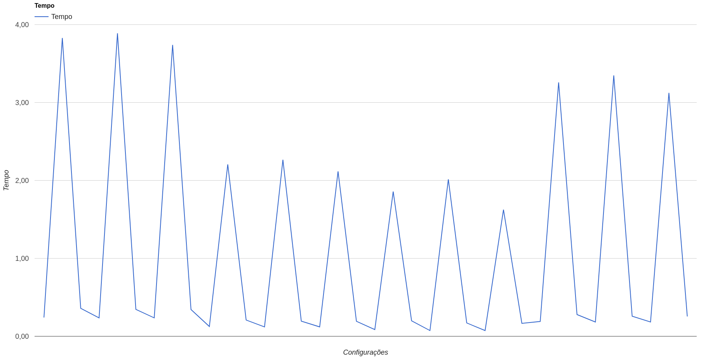

# Relatório Projeto 2 MC733

## Grupo:

|           Nome           |   RA   |
|:------------------------:|:------:|
|    Lucas Alves Racoci    | 156331 |
|        Rafael Zane       | 157079 |
| Luiz Fernando da Fonseca | 156475 |

## Introdução

Esse projeto visa estudar o desempenho de um processador comparando diferentes cenários em que são alteradas suas características estruturais. Foi utilizado o simulador _mips-2.4.0_ programado em _ArchC_, que simula um processador _MIPS_ sem considerar a existência de pipelines e hazards. Foram contabilizados os ciclos para três programas, _sha small_, _susan smoothing small_ e _dijkstra large_, para que fosse possível estimar o tempo de execução de cada um a partir de uma frequência teórica de cada configuração do processador. Características simuladas do processador foram pipelines de 5, 7 e 13 estágios simplificado, escalar e superescalar de 5 estágios, branch predictor always taken, always not taken e de 2 bits, além de utilizar o Dinero como biblioteca para estimar o efeito de diferentes caches.

## Configurações utilizadas

Abaixo estão listadas as 12 configurações que foram testadas:

- Configuração 1: Pipeline de 5 estágios simples, preditor always not taken.

- Configuração 2: Pipeline de 5 estágios simples, preditor always taken.

- Configuração 3: Pipeline de 5 estágios simples, preditor 2 bits.

- Configuração 4: Pipeline de 7 estágios simples, preditor always not taken.

- Configuração 5: Pipeline de 7 estágios simples, preditor always taken.

- Configuração 6: Pipeline de 7 estágios simples, preditor 2 bits.

- Configuração 7: Pipeline de 5 estágios superescalar dual issue, preditor always not taken.

- Configuração 8: Pipeline de 5 estágios superescalar dual issue, preditor always taken.

- Configuração 9: Pipeline de 5 estágios superescalar dual issue, preditor 2 bits.

- Configuração 10: Pipeline de 13 estágios simples, preditor always not taken.

- Configuração 11: Pipeline de 13 estágios simples, preditor always taken.

- Configuração 12: Pipeline de 13 estágios simples, preditor 2 bits.

## Eventos analisados
Para poder analisar o desempenho das diferentes configurações foram  escolhidos os seguintes eventos como parâmetros de comparação:

- Total de instruções.
- Ciclos sem considerar hazards e stalls.
- Cache misses da L1i.
- Cache misses da L1d.
- Cache misses da L2.
- Ciclos de ciclos de stall da cache.
- Contar ciclos de hazard de dados de instruções aritméticas.
- Contar ciclos de hazard de dados de instruções de load.
- Contar ciclos de hazard de dados para branches que usam resultados anteriores.
- Número de ciclos devidos a stalls no branch
- Número de ciclos devidos a stalls em jumps.

## Programas utilizados
Foram executados os seguintes programas para todas as configurações para que fosse possível avaliar os eventos citados:

- Dijkstra Large
- Sha Small
- Susan Smoothing Small

## Características do Processador

Abaixo estão listadas e explicadas as diferentes características que o processador podia possuir, considerando diferentes caches, tamanho do pipeline, tipo do pipeline e branch predictor.

### Caches

Foram utilizados dois níveis de cache, L1 (instruções e dados) e L2. Para simular diferentes configurações de cache, foi utilizado o software Dinero como biblioteca em conjunto com o simulador. Para isso, a biblioteca foi compilada e ligada através do Makefile do simulador.

Para simular operações de leitura e escrita, foram criadas as caches de maneira hierárquica, criando uma memória, ligando a L2 na memória, e depois ligando L1i e L1d na L2. Foram escritas funções _doread_ e _dowrite_ que simulavam leituras e escritas, passando o endereço e a cache como parâmetro para o Dinero cuidar da checagem de miss, considerando os diferentes parâmetros variáveis das caches: tamanho da cache, tamanho do bloco e associação. Os dois primeiros parâmetros são colocados em _log2_, pois o Dinero pega o valor e faz _2^valor_ para inicializar os parâmetros.

Os endereços que foram utilizados foram extraídos das variáveis do processador. O _PC_ para ler da cache L1i foi extraído ao chamar _ac\_behavior (instruction)_ e estava na variável _ac\_pc_. Os valores da L1d estavam em registradores nos diferentes tipos de instruções, podendo ser extraídos em cada instrução individualmente.

No final da simulação, os valores de misses para cada cache foram impressos considerando _READ_ e _WRITE_ (leitura e escrita), e também os valores de acessos totais, para poder ver a porcentagem de erros.

Primeiro foi utilizada a configuração 1 do processador para encontrar uma melhor configuração geral de cache para cada programa. Depois, foram utilizados estes valores de cache com o resto dos testes. Também foram definidos valores aproximados para considerar a quantidade de ciclos que cada miss na cache levaria em um processador real, sendo 15 para miss na L1 e 100 para miss na L2, pois o processador precisa ficar parado esperando o resultado vir da memória.

### Tamanho do Pipeline

Um pipeline pode ter diversos estágios, cada um com uma função específica dentro da implementação das instruções do processador. Foram utilizados os seguintes pipelines: 5 estágios baseado no livro texto do Henessy, 7 estágios também baseado no livro, 13 estágios simplificado baseado no processador Cortex A8 da _ARM_. Na tabela abaixo estão os nomes dos estágios:

| Tamanho do Pipeline | Estágios                                                                                |
|--------------------:|-----------------------------------------------------------------------------------------|
|                   5 | IF -> ID -> EX -> MEM -> WB                                                             |
|                   7 | IF0 -> IF1 -> ID -> EX -> MEM0 -> MEM1 -> WB                                            |
|                  13 | IF1 -> IF2 -> ID0 -> ID1 -> ID2 -> ID3 -> ID4 -> EX0 -> EX1 -> EX2 -> EX3 -> EX4 -> EX5 |

Primeiramente, foi considerado os pipelines de 5 e 7 estágios que são similares. IF é o estágio de buscar uma instrução da cache L1 de instruções. No de 7 estágios, é separada em duas etapas, sendo a primeira para usar uma _TLB_ (Translation Lookaside Buffer) para traduzir o endereço do PC em endereço físico, e a segunda faz a leitura da cache. ID é o estágio de decodificar instruções, ler o banco de registradores e fazer cálculo e decidir se os branches saltam. EX executa instruções através da _ALU_, podendo também ser usada para calcular endereços de memória para _loads_ e _stores_. MEM é o estágio para acessar a memória para estas duas últimas instruções. No caso de 7 estágios, também utiliza a _TLB_ na primeira parte para traduzir um endereço virtual em físico, e na segunda parte efetivamente acessa a memória. Neste trabalho não foi simulado acessos à _TLB_. O último estágio WB faz a escrita dos resultados das instruções no banco de registradores, na primeira metade do ciclo de clock. Ambos os pipelines utilizam forwardings sempre que possível para dar o menor número de stalls possível.

O pipeline de 13 estágios foi baseado no modelo real Cortex A8 da _ARM_, porém foi simplificado. O pipeline original era superescalar, sendo que duas instruções podiam ser executadas ao mesmo tempo. O simulado foi considerado apenas simples, uma instrução por vez. Um esquema do pipeline é mostrado na figura abaixo:

A partir do diagrama, pode-se perceber que existem três grandes blocos durante o pipeline dividindo etapas. No projeto, foi considerada apenas a etapa de execução e os hazards nela para simplificar. O estágio EX0 é responsável por ler do banco de registradores, e o estágio EX5 é equivalente ao WB. Os estágios intermediários são responsáveis por fazer os cálculos e também há o cálculo de branch predictor. Foram desconsiderados possíveis casos de forwardings durante a execução devido a complexidade do Cortex A8.

### Tipo do Pipeline

No caso do pipeline de 5 estágios, foi também utilizado um modelo de pipeline superescalar dual issue. No estágio IF, o processador lê uma palavra de 64 bits da memória, correspondendo a duas instruções, então elas são executadas ao mesmo tempo, podendo haver hazards e stalls para que dependências sejam tratadas. Foi considerado que haviam dois pipelines idênticos, e que a memória L1d aceitava duas lidas ou escritas simultâneamente.

### Branch Predictor

Foram considerados três tipos de branch predictors: always not taken, always taken e de 2 bits. Foi também considerado que havia uma tabela para os branches com os endereços dos saltos, apenas para simplificar, e para o branch poder ser resolvido no segundo estágio, igual o pipeline do livro do Henessy.

O preditor always not taken considera que o branch nunca salta. Quando ele erra é preciso carregar a instrução do branch e colocar um ciclo de stall no caso do pipeline de 5 estágios. Se for o de 7 estágios são 2 ciclos de stall. O preditor always taken considera que o branch sempre salta. Neste caso, quando ele erra, é preciso carregar a instrução correta e colocar um ciclo de stall no pipeline de 5 e 2 stalls no pipeline de 7. O pipeline de 13 estágios sempre tem penalidade de 13 estágios, devido a características do hardware.

O preditor de 2 bits é representado por uma máquina de estados de acordo com a figura abaixo:

Os stalls acontecem quando está em um estado e houve um erro de predição, como estar no weakly not taken e resultar que o branch salta. Assim, os estados são atualizados seguindo o diagrama. Há um ciclo de penalidade para pipeline de 5 estágios, 2 ciclos para o de 7 estágios e 13 para o de 13 estágios.

Instruções do tipo jump são consideradas como que sempre dão stall no pipeline, seguindo a mesma penalidade dos branches, pois é considerado que não há branch delay slot.

## Hazards estudados

Como descrito, alguns dos eventos analisados envolvem contagem de hazards. Para isso, foi estudado onde esses hazards acontecem nos pipelines de 5, 7 e 13 estágios simples e no de 5 estágios superescalar dual issue.

### Pipeline de 5 Estágios Simples

#### Hazard de Dados

Considerando hazard de dados no pipeline de 5 estágios simples, haviam alguns casos em que os hazards aconteciam e outros em que não aconteciam. Entre instruções aritméticas não ocorrem stalls pois há forwarding. Se há um load e depois uma instrução aritmética, ou load, que usa o resultado do primeiro, então é necessário um ciclo de stall. No caso de branches e jumps que usam resultados de instruções anteriores, se a imediatamente anterior for aritmética, é necessário um ciclo de stall; se a anterior for load é preciso dois ciclos de stall; se a anterior da anterior for load então é necessário um ciclo de stall.

#### Hazard de Controle

Neste caso, os branches errados sempre tomam um ciclo de stall pois são resolvidos no segundo estágio. No caso de jumps, sempre é considerado que o pipeline é parado, então há um ciclo de stall.

### Pipeline de 7 Estágios

#### Hazard de Dados

Neste caso, todos os hazards considerados no caso de 5 estágios simples também valem aqui, com o acréscimo de um ciclo para cada caso. Entre instruções aritméticas ainda é possível resolver com forwardings. Há dois novos casos, quando uma instrução usa um resultado de um load anterior à instrução anterior (duas antes), é preciso dar um ciclo de stall, e quando o load está a uma distância 3 de um branch um jump que usa o respectivo resultado, é necessário um ciclo também.

#### Hazard de Controle

Neste caso, branches errados tomam dois ciclos de stalls e jumps sempre levam dois ciclos de stalls.

### Pipeline de 13 Estágios

#### Hazard de Dados

Como neste caso foi simulada uma versão simplificada do Cortex A8, houveram hazards de todo tipo de instrução que se dependem durante a etapa de execução. Há 6 estágios, então existem 4 estágios de diferença entre a leitura de registradores em EX0 e o write back em EX5. Se uma instrução que está lendo registradores precisa de um resultado que ainda está sendo calculado e não chegou em EX5, então existem de 1 a 4 stalls que podem ser dados para que as dependências sejam resolvidas, considerando que não há forwardings.

#### Hazard de Controle

Foram utilizados 13 ciclos de penalidade para branches errados e sempre no caso de jumps.

### Pipeline de 5 Estágios Superescalar Dual Issue

#### Hazard de Dados

Como haviam dois pipelines, além dos hazards identificados no caso de 5 estágios simples, era preciso também considerar hazards entre os pipelines. Se duas instruções estão ao mesmo tempo e a segunda depende da primeira, então era preciso colocar uma bolha ou mais em cada pipe (dependendo em caso de instrução aritmética ou load), fazendo um deles avançar e um deles parar, para não desalinhar as próximas instruções que estavam chegando. Os hazards de 5 estágios são parecidos neste caso, mas também é preciso ter esse cuidado de desalinhar as instruções para tirar as dependências e não prejudicar a execução. Também é similar no caso de branches e jumps que dependem do resultado, mas é preciso checar nos dois pipelines as dependências.

#### Hazard de Controle

Para simular erro na predição dos branches, era importante considerar quando o branch ou jump estavam no pipeline 1 ou no pipeline 2. Se estavam no pipe 1, então era preciso de dois stalls em cada pipeline, de forma que o salto fique com uma bolha do lado e a instrução do pipe 2 também tivesse uma bolha ao lado, para não tirar o alinhamento das instruções que entrariam em seguida. Se estavam no pipe 2, então apenas utilizava um ciclo de stall em cada pipeline.

## Resultados

### Melhor Configuração de Cache

Primeiramente, foram testadas 4 configurações de cache para todos os programas com o pipeline de 5 estágios simples e preditor de branch always not taken. Os parâmetros da cache são mostrados na tabela abaixo:

|                 | Configuração 1 | Configuração 2 | Configuração 3 | Configuração 4 |
|----------------:|:--------------:|:--------------:|:--------------:|:--------------:|
| L1i ou L1d size |       14       |       14       |       15       |       15       |
|        L1 assoc |        2       |        4       |        2       |        4       |
|   L1 block size |        4       |        4       |        4       |        4       |
|         L2 size |       18       |       18       |       19       |       19       |
|        L2 assoc |        2       |        4       |        2       |        4       |
|   L2 block size |        5       |        5       |        5       |        5       |

O valor correto para tamanho (size) e tamanho do bloco (block size) são _2^valor_ da tabela, medido em bytes. Então foram rodadas as 4 configurações com os 3 programas para escolher um melhor valor global para usar na cache no resto dos testes. Os valores dos caches misses para cada caso e a porcentagem de miss nas caches são mostrados abaixo para cada caso:

|            | Configuração 1 |          | Configuração 2 |          | Configuração 3 |          | Configuração 4 |          |
|------------|----------------|----------|----------------|----------|----------------|----------|----------------|----------|
| Sha:       | miss           | fetch    | miss           | fetch    | miss           | fetch    | miss           | fetch    |
| L1i read:  | 3745           | 1,32E+12 | 3722           | 1,32E+12 | 3706           | 1,32E+12 | 3699           | 1,32E+12 |
| L1d read:  | 98065          | 1,93E+11 | 98957          | 1,93E+11 | 95080          | 1,93E+11 | 88429          | 1,93E+11 |
| L1d write: | 12241          | 820020   | 13756          | 820020   | 11683          | 820020   | 9712           | 820020   |
| L2 read:   | 83940          | 101810   | 83930          | 102679   | 74711          | 98786    | 72723          | 92128    |
| L2 write:  | 360            | 3036     | 411            | 3584     | 309            | 2778     | 195            | 2091     |
| Dijkstra:  | miss           | fetch    | miss           | fetch    | miss           | fetch    | miss           | fetch    |
| L1i read:  | 136488         | 2,24E+13 | 61180          | 2,24E+13 | 30898          | 2,24E+13 | 12251          | 2,24E+13 |
| L1d read:  | 5,98E+11       | 4,20E+12 | 5,95E+11       | 4,20E+12 | 2,91E+11       | 4,20E+12 | 2,91E+10       | 4,20E+12 |
| L1d write: | 300226         | 2,14E+12 | 283787         | 2,14E+12 | 210417         | 2,14E+12 | 218685         | 2,14E+12 |
| L2 read:   | 11792          | 6,11E+11 | 11081          | 6,01E+11 | 10317          | 2,94E+11 | 9956           | 2,92E+11 |
| L2 write:  | 3781           | 159502   | 3689           | 140180   | 3544           | 95618    | 3496           | 91619    |
| Susan:     | miss           | fetch    | miss           | fetch    | miss           | fetch    | miss           | fetch    |
| L1i read:  | 11988          | 3,16E+12 | 7563           | 3,16E+12 | 6932           | 3,16E+12 | 6710           | 3,16E+12 |
| L1d read:  | 9427           | 6,49E+11 | 10224          | 6,49E+11 | 5046           | 6,49E+11 | 5090           | 6,49E+11 |
| L1d write: | 6484           | 647694   | 7921           | 647694   | 4951           | 647694   | 4916           | 647694   |
| L2 read:   | 11518          | 21415    | 11502          | 17787    | 11481          | 11978    | 11475          | 11800    |
| L2 write:  | 459            | 811      | 538            | 951      | 64             | 76       | 69             | 73       |

|       Sha: | Configuração 1 | Configuração 2 | Configuração 3 | Configuração 4 |
|-----------:|:--------------:|:--------------:|:--------------:|:--------------:|
|  L1i read: |      0,00%     |      0,00%     |      0,00%     |      0,00%     |
|  L1d read: |      0,00%     |      0,00%     |      0,00%     |      0,00%     |
| L1d write: |      1,49%     |      1,68%     |      1,42%     |      1,18%     |
|   L2 read: |     82,45%     |     81,74%     |     75,63%     |     78,94%     |
|  L2 write: |     11,86%     |     11,47%     |     11,12%     |      9,33%     |

|  Dijkstra  | Configuração 1 | Configuração 2 | Configuração 3 | Configuração 4 |
|:----------:|:--------------:|:--------------:|:--------------:|:--------------:|
|  L1i read: |      0,00%     |      0,00%     |      0,00%     |      0,00%     |
|  L1d read: |     14,22%     |     14,16%     |      6,92%     |      0,69%     |
| L1d write: |      0,00%     |      0,00%     |      0,00%     |      0,00%     |
|   L2 read: |      0,00%     |      0,00%     |      0,00%     |      0,00%     |
|  L2 write: |      2,37%     |      2,63%     |      3,71%     |      3,82%     |

|      Susan | Configuração 1 | Configuração 2 | Configuração 3 | Configuração 4 |
|-----------:|:--------------:|:--------------:|:--------------:|:--------------:|
|  L1i read: |      0,00%     |      0,00%     |      0,00%     |      0,00%     |
|  L1d read: |      0,00%     |      0,00%     |      0,00%     |      0,00%     |
| L1d write: |      1,00%     |      1,22%     |      0,76%     |      0,76%     |
|   L2 read: |     53,78%     |     64,67%     |     95,85%     |     97,25%     |
|  L2 write: |     56,60%     |     56,57%     |     84,21%     |     94,52%     |

A partir dos valores das tabelas, foi possível estimar uma "melhor" configuração global de cache para os três programas. A configuração escolhida foi a 1, pois, considerado o ganho do aumento dos parâmetros de cache entre os programas, percebe-se que os percentuais não apresentam ganhos relativos elevados, e em alguns casos ocorre de aumentar os misses na L2. Esse aumento pode ser explicado porque existem poucos acessos a cache L2, pois a L1 estaria muito grande, então pegar tamanhos menores como a configuração 1, apesar de resultar em mais ciclos, seria mais adequado, já que aumentar a cache é caro.

### Configurações do Processador

Depois, foram testadas as 12 configurações do processador, com a melhor configuração de cache encontrada e para cada um dos três programas. Foram utilizados os valores dos stalls das caches (L1,L2) = (15,100) ciclos, e também foi calculado, a partir do número de ciclos, um tempo de execução para cada programa. As fórmulas utilizadas para os cálculos foram:

	$ ciclos_cache += (L1d->miss[D4XREAD] + L1d->miss[D4XWRITE] + L1i->miss[D4XREAD]) * CACHE_L1_STALL + (L2->miss[D4XREAD] + L2->miss[D4XWRITE]) * CACHE_L2_STALL;
	
sendo representados os stalls e misses de escrita e leitura,

	$ C += ciclos_arit + ciclos_load + ciclos_branch + ciclos_jump + ciclos_cache + ciclos_misspredict;

	$ T = C / F
	
onde _T_ é o tempo de execução, _F_ é a frequência e _C_ são os ciclos totais da execução considerando todos os atrasos. No caso superescalar, antes de calcular _C_, seu valor foi passado pela seguinte fórmula para calcular os ciclos considerando que iniciava-se com 4 ciclos a contagem inicial do pipeline:

	$ C = C / 2 + 2
	
Os valores da frequência dos diferentes processadores foram escolhidas considerando valores práticos e estão na tabela abaixo:

|     Tipo do Processador | Frequência |
|------------------------:|------------|
|      5 Estágios Simples | 100 MHz    |
|              7 Estágios | 200 MHz    |
|             13 Estágios | 500 MHz    |
| 5 Estágios Superescalar | 100 MHz    |

Então, foram realizados os testes com os 3 programas seguindo cada uma das 12 configurações e os resultados estão na tabela abaixo, sendo que os valores de misses e fetches das caches já foram mostrados na seção anterior:

| Configuração                                         | 5 NOT_TAKEN |           |          | 5 TAKEN  |           |          | 5 2BITS  |           |          | 7 NOT_TAKEN |           |          | 7 TAKEN  |           |          | 7 2BITS  |           |          | 13 NOT TAKEN |           |          | 13 TAKEN |            |          | 13 2BITS |           |          | SUPERESCALAR NOT TAKEN |           |          | SUPERESCALAR TAKEN |           |          | SUPERESCALAR 2BITS |           |          |
|------------------------------------------------------|-------------|-----------|----------|----------|-----------|----------|----------|-----------|----------|-------------|-----------|----------|----------|-----------|----------|----------|-----------|----------|--------------|-----------|----------|----------|------------|----------|----------|-----------|----------|------------------------|-----------|----------|--------------------|-----------|----------|--------------------|-----------|----------|
| Configuração                                         | Sha         | Dijkstra  | Susan    | Sha      | Dijkstra  | Susan    | Sha      | Dijkstra  | Susan    | Sha         | Dijkstra  | Susan    | Sha      | Dijkstra  | Susan    | Sha      | Dijkstra  | Susan    | Sha          | Dijkstra  | Susan    | Sha      | Dijkstra   | Susan    | Sha      | Dijkstra  | Susan    | Sha                    | Dijkstra  | Susan    | Sha                | Dijkstra  | Susan    | Sha                | Dijkstra  | Susan    |
| Número total de instruções                           | 13175667    | 223690619 | 31618819 | 13175667 | 223690619 | 31618819 | 13175667 | 223690619 | 31618819 | 13175667    | 223690619 | 31618819 | 13175667 | 223690619 | 31618819 | 13175667 | 223690619 | 31618819 | 13175667     | 223690619 | 31618819 | 13175667 | 223690619  | 31618819 | 13175667 | 223690619 | 31618819 | 13175667               | 223690619 | 31618819 | 13175667           | 223690619 | 31618819 | 13175667           | 223690619 | 31618819 |
| Número total de ciclos de hazards aritméticos        | 0           | 0         | 0        | 0        | 0         | 0        | 0        | 0         | 0        | 0           | 0         | 0        | 0        | 0         | 0        | 0        | 0         | 0        | 9606076      | 124636889 | 24112902 | 9586583  | 124644702  | 28392375 | 9586584  | 124644702 | 28384994 | 529821                 | 6426682   | 2767333  | 529821             | 6426682   | 2767333  | 529821             | 6426682   | 2767333  |
| Número total de ciclos de hazards de load            | 0           | 0         | 0        | 0        | 0         | 0        | 0        | 0         | 0        | 362765      | 5360406   | 3489505  | 362765   | 5360406   | 3489505  | 362765   | 5360406   | 3489505  | 1127085      | 15556856  | 10523134 | 1127085  | 15556856   | 10523524 | 1127085  | 15556856  | 10523134 | 366830                 | 4609698   | 3427339  | 366830             | 4609698   | 3426608  | 366830             | 4609698   | 3426608  |
| Número total de ciclos de hazards de branch          | 30910       | 34030333  | 439289   | 30910    | 34030333  | 439289   | 30910    | 34030333  | 439289   | 53869       | 59590154  | 483127   | 53869    | 59590154  | 483127   | 53869    | 59590154  | 483127   | 1330327      | 111523753 | 2320697  | 1330327  | 111531569  | 2319902  | 1330327  | 111527661 | 2320348  | 468096                 | 64221215  | 861347   | 468096             | 64221215  | 861216   | 468096             | 64221215  | 861297   |
| Número total de ciclos de stalls de jumps            | 39800       | 9419877   | 276246   | 39800    | 9419877   | 276246   | 39800    | 9419877   | 276246   | 79600       | 18839754  | 552492   | 79600    | 18839754  | 552492   | 79600    | 18839754  | 552492   | 517400       | 122458401 | 3591198  | 517400   | 122458401  | 3591198  | 517400   | 122458401 | 3591198  | 59698                  | 14082410  | 413657   | 59698              | 14082410  | 413657   | 59698              | 14082410  | 413657   |
| Número total de ciclos de stalls de branches errados | 525545      | 17956085  | 1969862  | 41550    | 23953352  | 563980   | 46447    | 9002440   | 376179   | 1051090     | 35912170  | 3939724  | 83100    | 47906704  | 1127960  | 92894    | 18004880  | 752358   | 6832085      | 233429105 | 25608206 | 540150   | 311393576  | 7331740  | 603811   | 117031720 | 4890327  | 788328                 | 26884801  | 2955346  | 62325              | 35881364  | 846176   | 69671              | 13453886  | 564544   |
| Número total de ciclos de stalls de cache            | 10140765    | 97768380  | 1616185  | 10140765 | 97768380  | 1616185  | 10140765 | 97768380  | 1616185  | 10140765    | 97768380  | 1616185  | 10140765 | 97768380  | 1616185  | 10140765 | 97768380  | 1616185  | 10140765     | 97768380  | 1616185  | 10140765 | 97768380   | 1616185  | 10140765 | 97768380  | 1616185  | 10140765               | 97768380  | 1616185  | 10140765           | 97768380  | 1616185  | 10140765           | 97768380  | 1616185  |
| Número total de ciclos totais                        | 24068595    | 382865298 | 35924547 | 23584600 | 388862565 | 34518665 | 23589497 | 373911653 | 34330864 | 25019666    | 441161489 | 41704000 | 24051676 | 453156023 | 38892236 | 24061470 | 423254199 | 38516634 | 42885321     | 929064015 | 99395295 | 36573893 | 1007044115 | 85397897 | 36637555 | 812678351 | 82949159 | 19019327               | 325838499 | 27852691 | 18293324           | 334835062 | 25742659 | 18300670           | 312407584 | 25461108 |
| Tempo                                                | 0,24        | 3,83      | 0,36     | 0,24     | 3,89      | 0,35     | 0,24     | 3,74      | 0,34     | 0,13        | 2,21      | 0,21     | 0,12     | 2,27      | 0,19     | 0,12     | 2,12      | 0,19     | 0,09         | 1,86      | 0,20     | 0,07     | 2,01       | 0,17     | 0,07     | 1,63      | 0,17     | 0,19                   | 3,26      | 0,28     | 0,18               | 3,35      | 0,26     | 0,18               | 3,12      | 0,25     |

Foi também construído um gráfico com os tempos de execução no eixo y e no eixo x estão as configurações seguindo a ordem da tabela, sendo que o lugar onde dois segmentos de retas se encontram é o tempo.

## Análise

A partir dos valores simulados, pode-se perceber que as caches possuem um enorme impacto na quantidade de ciclos da execução dos programas. Isso é razoável de pensar já a cada miss pode ocorrer de gastar 15 ciclos ociosos ou 100 em um pior caso. Por isso, é necessário um trade-off entre custo e parâmetros das caches, pois aumentar a cache diminui os misses, mas podem ocorrer poucos acessos a L2, indicando que a L1 é grande e dinheiro estaria sendo gasto desnecessariamente.

Analisando os tempos dadas as frequências, percebe-se que há uma melhora no tempo de execução considerando pipelines maiores. Os tempos do pipeline de 7 estágios tiveram uma diminuição de metade do tempo aproximadamente em relação ao de 5 estágios simples. O de 13 também teve um ganho em relação aos outros. O único que não aumentou o que era esperado foi o superescalar de 5 estágios. Ocorreu um ganho nesse caso em relação ao de 5 estágios comum, porém pensando que tudo deveria ser dobrado, e portanto os ciclos divididos pela metade, o ganho foi pequeno. Isso pode ser explicado pelo fato de os programas não serem compilados para rodar em um processador superescalar, pois nesse caso o compilador poderia tirar dependências e otimizar o código para este caso.

Por fim, vendo os valores em relação aos preditores de branch, pode-se perceber que o melhor preditor no geral foi o de 2 bits, o que era esperado por ser o mais complexo dos três. Em relação aos outros dois, ambos variaram de qual seria o melhor dependendo do caso, pois as duas abordagens possuem 50% de possibilidade de salto.

## Conclusão

A partir dos testes e simulações feitas, pode-se ter um contato maior com uma extensa base de código em ArchC que simula processadores. Também foi percebida a dificuldade de se simular programas que executam em processadores diferentes, variando tamanho do pipeline, superescalar e caches, pois algumas decisões tiveram que ser feitas sem ter implementações de processadores reais. Com relação aos valores de caches e os misses calculados, o resultado foi interessante uma vez que aumentar o tamanho da cache pode aumentar a porcentagem de misses que podem acontecer, porém diminui a quantidade de misses absolutos. Por fim, os valores dos tempos simulados saíram todos conforme o esperado, mostrando melhoras na maioria dos casos e mostrando que o preditor de 2 bits é o melhor entre os que foram simulados.