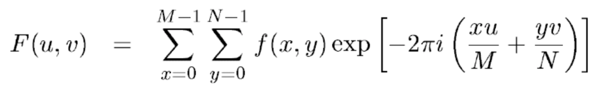
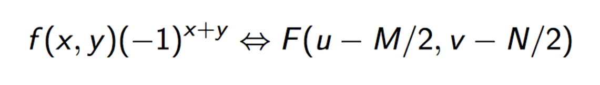
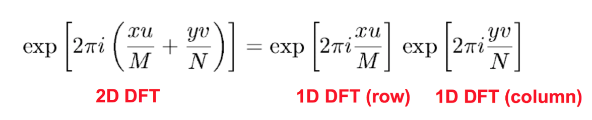
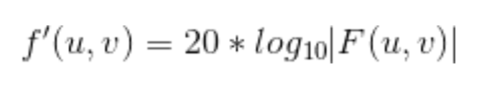
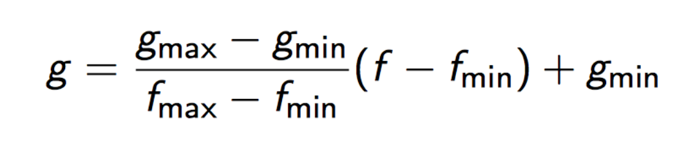
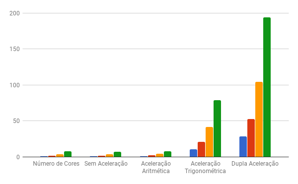
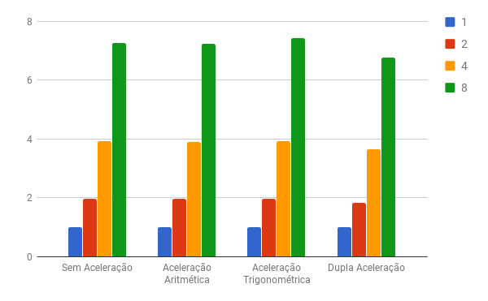
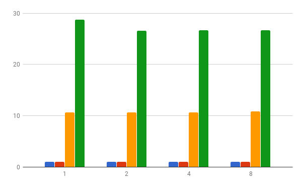

# Relatório Projeto 3 MC733

## Grupo 4:

|           Nome           |   RA   |
|:------------------------:|:------:|
|    Lucas Alves Racoci    | 156331 |
|        Rafael Zane       | 157079 |
| Luiz Fernando da Fonseca | 156475 |

## Introdução

Nesse trabalho foram realizados experimentos com o objetivo de analisar o desempenho de diferentes números de processadores (1,2,4,8) na execução de uma aplicação que calcula o Espectro de Fourier com a DFT (Transformada Discreta de Fourier) e desloca a origem desse espectro, colocando o resultado em uma imagem. Foi ainda analisado o desempenho utilizando-se periféricos que realizam operações de ponto flutuante e operações trigonométricas que aceleram a execução.

## Aplicação a ser Paralelizada

A aplicação que será paralelizada é o cálculo da DFT de uma imagem. A imagem que foi utilizada e o seu Espectro de Fourier estão nos arquivos _noise\_blur\_00.pgm_ e _saida.pgm_. O formato de imagem a ser utilizado é o _PGM_, formato binário _P5_ para imagens em preto e branco. Assim, foram utilizados códigos em _C_ para ler e escrever imagens _PGM_.

É importante ressaltar que uma imagem é uma matriz bidimensional f(x,y) de inteiros de 8 bits sem sinal. A origem da imagem (e da matriz) está no canto superior esquerdo. Para calcular a DFT foi utilizada a seguinte fórmula.

Para a transformada tiver o centro no meio da imagem, é utilizada a seguinte fórmula antes da aplicação da transformada para realizar esse deslocamento.

Uma característica da DFT é que ela é separável, ou seja, pode ser aplicada em uma dimensão primeiro (linhas) e depois na outra (colunas), ou vice-versa. Isso diminui a complexidade do código de O(n^4) para O(n^3).

Para calcular a imagem de saída f'(x,y), é utilizada abaixo, e depois é feita uma transformada linear para adequar os valores dos pixels para o intervalo 0 a 255.

## Paralelização

Como foi dito a aplicação opera sobre uma imagem, que é uma matriz bidimensional de pixels, dessa forma, a paralelização foi realizada dividindo-se a quantidade total de linhas da matriz da maneira mais igualitária possível entre todos os processadores. Assim a diferença entre as quantidades de linhas destinadas a dois processadores não é maior que uma linha. É importante notar que as variáveis compartilhadas tiveram que ser declaradas volatile e globais. Foram utilizados locks locais, com a utilização do periférico de lock, para garantir exclusão mútua. Para definir a quantidade de processadores, é preciso alterar a constante na aplicação e a constante no arquivo _bus/bus.h_.

Cada processador lê e escreve em uma região das matrizes, no entanto, na função de DFT os processadores lêem posições da região de outros processadores da matriz P (a matriz auxiliar para cálculo da primeira transformada), que é construída no início da função, logo é necessário que todos os processadores tenham terminado de escrever na matriz P, portanto foi usada uma barreira para sincronizar os processadores. Uma dependência similar ocorre na função transforma\_intervalo, onde são utilizados os valores de máximo e mínimo da matriz F, logo cada processador deve ter calculado o máximo e o mínimo da sua região e atualizado os valores de máximo e mínimo da matriz toda (caso necessário), portanto também foi utilizada uma barreira nesse ponto. Um outro uso de barreiras foi para que todos os processadores só começassem a função desloca\_origem quando o processador de id 0 terminasse de ler a entrada toda e para que o processador de id 0 só desse a saída quando todos os processadores terminassem a função transforma\_intervalo. Foi ainda utilizada uma barreira para que a simulação só fosse terminada quando o processador 0 terminasse de dar a saída.

Os únicos pontos do programa que não foram paralelizados foram a leitura no arquivo de entrada e a escrita no arquivo de saída, isso se deve pelo fato que os diferentes processadores não podem acessar simultaneamente esses arquivos, e cada um deles abrir e fechar o arquivo múltiplas vezes para que possam dividir o acesso não é interessante em termos de desempenho.

## Periféricos

Os periféricos de operações trigonométricas e de ponto flutuante foram construídos com o intuito de acelerar a aplicação realizando com poucas instruções as operações descritas. Como os periféricos foram utilizados também nos experimentos que envolviam mais de um processador, foi necessário criar um periférico de cada tipo para cada processador, de modo que dois processadores pudessem realizar essas operações ao mesmo tempo. Isso foi obtido replicando as posições de memória para cada processador, sendo que o efeito prático é a total replicação de cada periférico completamente.

Para implementar os periféricos, foram criados arquivos separados para cada periférico. Para ligar tudo, foram alterados os arquivos da pasta _bus_ para direcionar os endereços de memória corretos para os periféricos, utilizando também o valor da quantidade de processadores para reservar mais espaço para que existam cópias dos periféricos, um para cada processador. Estes arquivos estão genéricos o suficiente para que o tamanho de cada periférico seja adequado ao número de processadores. Após a memória, o primeiro periférico que existe é o de lock, seguido pelo de ponto flutuante e depois o trigonométrico.

Os endereços de memória da escrita de argumentos e leitura dos resultados são replicados para os diferentes processadores, sendo que na aplicação o id do processador é usado para indexar um vetor de uma estrutura que representa cada periférico. O endereço base desse vetor é posicionado no endereço base do periférico, sendo que com diferentes cores os periféricos terão tamanhos diferentes.

Quando uma requisição chegava a qualquer periférico para uma escrita, era necessário corrigir o endian e depois fazer o cast bit a bit do valor uint32\_t que chega para float. Para isso foi utilizada as seguintes linhas de código:

	uint32_t data = be32toh(d);
	float fdata = *reinterpret_cast<float*>(&data);

A função _be32toh_ transforma um big endian de 32 bits para o endian do host, ou seja, do computador que está sendo rodado o simulador. A segunda linha faz o cast bit a bit para float.

Quando chegava uma requisição de leitura, era necessário fazer o processo inverso, utilizando a seguinte linha de código:

	uint32_t data = htobe32(*reinterpret_cast<uint32_t*>(&fdata));

### Ponto Flutuante

Para implementar o periférico de ponto flutuante, para cada processador, foram utilizadas duas posições de memória para receber os argumentos da operação. Para o resultado, foi reservada uma posição de memória para cada uma das seguintes operações, sendo calculadas em hardware em paralelo: add, sub, mul, div, log2 e sqrt. Assim, é possível escrever os dois argumentos e ler da posição respectiva a operação para saber a resposta. Foram utilizados vetores de argumentos para simular diferentes espaços de memória para diferentes processadores, sendo idexados através do endereço de memória passado para o periférico e tendo o cálculo de qual processador era responsável por aquela requisição.

### Trigonométrico

Para implementar o periférico trigonométrico, para cada processador, foram utilizadas duas posições de memória, uma para o seno e outra para o cosseno. Assim, para calcular o seno, o argumento era escrito na posição do seno, e da mesma posição era lido o resultado. O mesmo vale para o cosseno. Também foi utilizado um vetor no periférico para guardar os argumentos dos diferentes processadores, e quando havia uma operação de leitura, era utilizado o endereço de memória passado para indexar o vetor e calcular a resposta.

## Configurações dos Experimentos

Foram utilizadas as seguintes configurações para realização dos testes, utilizando como entrada a imagem _noise\_blur\_00.pgm_ de tamanho 100x100 no código:

+ Single Core sem aceleração
+ Single Core com aceleração aritmética
+ Single Core com aceleração trigonométrica
+ Single Core com dupla aceleração
+ 2 Cores sem aceleração
+ 2 Cores com aceleração aritmética
+ 2 Cores com aceleração trigonométrica
+ 2 Cores com dupla aceleração
+ 4 Cores sem aceleração
+ 4 Cores com aceleração aritmética
+ 4 Cores com aceleração trigonométrica
+ 4 Cores com dupla aceleração
+ 8 Cores sem aceleração
+ 8 Cores com aceleração aritmética
+ 8 Cores com aceleração trigonométrica
+ 8 Cores com dupla aceleração

Como existem várias configurações, foram criados diferentes versões da aplicação: _antiga.c_, _aplicacao\_paralela.c_, _app\_mult\_acc.c_ e _app\_single\_acc.c_. Para rodar no simulador, ou é alterado o Makefile ou apenas é preciso copiar o código a ser rodado no arquivo _aplicacao.c_.

## Resultados

A Tabela 1 abaixo mostra a quantidade de instruções executadas por processador em cada um dos experimentos realizados. A Tabela 2 mostra a quantidade máxima de instruções dentre todos os cores em cada um dos experimentos. A Tabela 3 mostra os speedups dos experimentos, utilizando os valores máximos presentes na Tabela 3, em relação ao experimento com single core e sem aceleração, representando o ganho da aceleração dos periféricos junto com o de paralelização. Na Tabela 4 temos os speedups em relação ao experimento single core para cada um dos casos: sem aceleração, aceleração aritmética, aceleração trigonométrica e dupla aceleração, representando o ganho da paralelização. Por fim a Tabela 5 mostra os speedups em relação aos experimentos sem aceleração para os casos de 1,2,4 e 8 cores, representando o ganho com o uso dos periféricos.

Tabela 1: Quantidade de instruções.

| Número de Cores | Sem Aceleração | Aceleração Aritmética | Aceleração Trigonométrica | Dupla Aceleração |
|:---------------:|:--------------:|:---------------------:|:-------------------------:|:----------------:|
|        1        |   37306277437  |      34811910474      |         3512378469        |    1299709291    |
|        2        |   18804574925  |      17591969525      |         1779157247        |     710608386    |
|                 |   18916758252  |      17705012016      |         1779793288        |     711097476    |
|        4        |   9406758022   |       8799324536      |         892533923         |     356281969    |
|                 |   9411264960   |       8802602248      |         894710876         |     356769997    |
|                 |   9416004055   |       8807955933      |         894422048         |     356769861    |
|                 |   9514202285   |       8907013491      |         893458859         |     356771296    |
|        8        |   5048770539   |       4730302007      |         471966254         |     192046345    |
|                 |   5132821016   |       4814389305      |         472419486         |     192535652    |
|                 |   4913529966   |       4592375352      |         465647882         |     186687134    |
|                 |   4930170643   |       4597730343      |         466060964         |     186687171    |
|                 |   4908464581   |       4614426076      |         465670272         |     186687293    |
|                 |   4911608194   |       4594647796      |         466608821         |     186687137    |
|                 |   5047570963   |       4730993739      |         473270666         |     192534374    |
|                 |   5050451278   |       4729239099      |         472004929         |     192534470    |

Tabela 2: Quantidade máxima de instruções dentre todos os cores.

| Número de Cores | Sem Aceleração | Aceleração Aritmética | Aceleração Trigonométrica | Dupla Aceleração |
|:---------------:|:--------------:|:---------------------:|:-------------------------:|:----------------:|
|        1        |   37306277437  |      34811910474      |         3512378469        |    1299709291    |
|        2        |   18916758252  |      17705012016      |         1779793288        |     711097476    |
|        4        |   9514202285   |       8907013491      |         894710876         |     356771296    |
|        8        |   5132821016   |       4814389305      |         473270666         |     192535652    |

Tabela 3: Speedups em relação ao experimento single core sem aceleração.

| Número de Cores | Sem Aceleração | Aceleração Aritmética | Aceleração Trigonométrica | Dupla Aceleração |
|:---------------:|:--------------:|:---------------------:|:-------------------------:|:----------------:|
|        1        |        1       |      1,071652688      |        10,62137175        |    28,70355525   |
|        2        |   1,972128466  |      2,107102633      |        20,96101704        |    52,46295859   |
|        4        |   3,921114595  |      4,188415957      |        41,69646132        |    104,5663647   |
|        8        |   7,268182023  |      7,748911663      |        78,82651539        |    193,7629579   |

Tabela 4: Speedups em relação aos experimentos single core.

| Número de Cores | Sem Aceleração | Aceleração Aritmética | Aceleração Trigonométrica | Dupla Aceleração |
|:---------------:|:--------------:|:---------------------:|:-------------------------:|:----------------:|
|        1        |        1       |           1           |             1             |         1        |
|        2        |   1,972128466  |      1,966217839      |        1,973475511        |    1,827751236   |
|        4        |   3,921114595  |      3,908370691      |        3,925713393        |    3,642976062   |
|        8        |   7,268182023  |      7,230805045      |        7,421500468        |    6,750486351   |

Tabela 5: Speedups em relação aos experimentos sem aceleração.

| Número de Cores | Sem Aceleração | Aceleração Aritmética | Aceleração Trigonométrica | Dupla Aceleração |
|:---------------:|:--------------:|:---------------------:|:-------------------------:|:----------------:|
|        1        |        1       |      1,071652688      |        10,62137175        |    28,70355525   |
|        2        |        1       |      1,068440859      |        10,62862658        |    26,60220137   |
|        4        |        1       |       1,06816974      |         10,6338288        |    26,66751051   |
|        8        |        1       |      1,066141662      |        10,84542395        |    26,65906788   |

## Análise

Os gráficos 1, 2 e 3 a seguir são referentes as tabelas de resultados encontradas.

Gráfico 1: Speedups referentes a Tabela 3.

Gráfico 2: Speedups referentes a Tabela 4.

Gráfico 3: Speedups referentes a Tabela 5.

Analisando primeiramente o gráfico 1, que representa o ganho da paralelização combinado com o do uso dos periféricos, temos que o speedup de aceleração aritmética é cerca de 1,07 vezes o número de cores, a trigonométrica é cerca de 10 vezes o número de cores e a aceleração dos dois periféricos é de cerca de 26 vezes o número de cores. Esse resultado condiz com a utilização de paralelização separadamente e de aceleração por periféricos separadamente. O resultado mais impressionante foi o ganho obtido com a aceleração trigonométrica e a dupla aceleração, pois em comparação com o original em paralelização e sem aceleração, o ganho esteve entre 41 e 193. Isso mostra que as operações aritméticas gastam muito processamento de ponto flutuante, que são operações que o simulador do MIPS não possui por padrão, e ter um hardware que as executa tão rapidamente diminui muito a quantidade de instruções para rodar o programa.

Analisando o Gráfico 2, pode-se observar que para um mesmo cenário de periférico, ao se dobrar a quantidade de cores, o speedup praticamente dobra também, o que é o esperado ao se paralelizar, mostrando que a paralelização divide corretamente entre os processadores o trabalho da aplicação. Existem, no entanto, alguns desvios, como pode ser visto principalmente quando são utilizados 8 cores, em que o ganho é de um pouco mais que 7 vezes e não 8 vezes em relação ao caso single core. Os desvios existentes se devem as instruções gastas pelos processadores tentando adquirir locks e quanto mais processadores mais é gasto com instruções desse tipo, porém o ganho ainda é muito bom.

Por fim, gráfico 3 mostra que o ganho utilizando unicamente o periférico de operações aritméticas é bem baixo, sendo que o speedup é de cerca de 1,07. Já o speedup com o periférico de operações trigonométricas é bem maior, sendo por volta de 10,6. Isso mostra que a aplicação ao ser executada sem periféricos gasta muito mais ciclos com operações trigonométricas do que aritméticas. Ao combinarmos os dois periféricos, o speedup passa a ser de 28 vezes, o que foi um ganho muito bom.

## Conclusão

Conclui-se que a aplicação do Espectro de Fourier é uma aplicação altamente paralelizável de modo que dobrar a quantidade de processadores reduz para quase a metade a quantidade de instruções executadas por cada processador. Foi possível observar que as operações aritméticas tem um impacto bem menor do que as trigonométricas em relação ao número de instruções executadas pois o uso do periférico de aceleração trigonométrica aumentou o speedup muito mais que o uso do periférico de operações aritméticas. Entretanto, os ganhos obtidos com o periférico trigonométrico em conjunto com a paralelização foram muito bons, reduzindo muito a quantidade de instruções necessárias para rodar o código.
