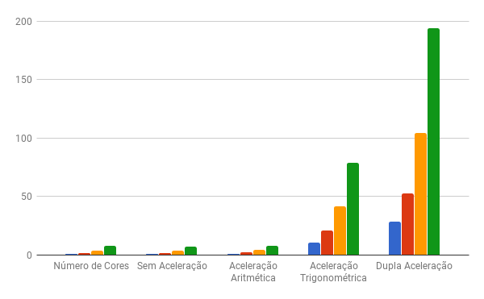
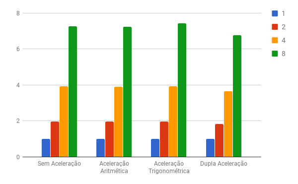
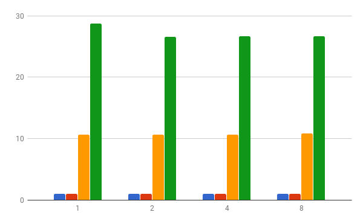

# Relatório Projeto 3 MC733

## Grupo 4:

|           Nome           |   RA   |
|:------------------------:|:------:|
|    Lucas Alves Racoci    | 156331 |
|        Rafael Zane       | 157079 |
| Luiz Fernando da Fonseca | 156475 |

## Introdução

Nesse trabalho foram realizados experimentos com o objetivo de analisar o desempenho de diferentes números de processadores (1,2,4,8) na execução de uma aplicação que calcula o Espectro de Fourier e desloca a origem desse espectro. Foi ainda analisado o desempenho utilizando-se periféricos que realizam operações de ponto flutuante e operações trigonométricas que aceleram a execução.

## Aplicação a ser Paralelizada

## Paralelização
Como foi dito a aplicação opera sobre uma imagem, que é uma matriz bidimensional de pixels, dessa forma, a paralelização foi realizada dividindo-se a quantidade total de linhas da matriz da maneira mais igualitária possível entre todos os processadores. Assim a diferença entre as quantidades de linhas destinadas a dois processadores não é maior que uma linha.

Cada processador lê e escreve em uma região das matrizes, no entanto, na função de DFT os processadores lêem posições da região de outros processadores da matriz P, que é construída no início da função, logo é necessário que todos os processadores tenham terminado de escrever na matriz P, portanto foi usada uma barreira para sincronizar os processadores. Uma dependência similar ocorre na função transforma_intervalo, onde são utilizados os valores de máximo e mínimo da matriz F, logo cada processador deve ter calculado o máximo e o mínimo da sua região e atualizado os valores de máximo e mínimo da matriz toda (caso necessário), portanto também foi utilizada uma barreira nesse ponto. Um outro uso de barreiras foi para que todos os processadores só começassem a função desloca_origem quando o processador de id 0 terminasse de ler a entrada toda e para que o processador de id 0 só desse a saída quando todos os processadores terminassem a função transforma_intervalo. Foi ainda utilizada uma barreira para que a simulação só fosse terminada quando o processador 0 terminasse de dar a saída.

Os únicos pontos do programa que não foram paralelizados foram a leitura no arquivo de entrada e a escrita no arquivo de saída, isso se deve pelo fato que os diferentes processadores não podem acessar simultaneamente esses arquivos, e cada um deles abrir e fechar o arquivo múltiplas vezes para que possam dividir o acesso não é interessante em termos de desempenho.

## Periféricos
Os periféricos de operações trigonométricas e de ponto fluente foram construídos com o intuito de acelerar a aplicação realizando com apenas uma instrução as operações descritas. Como os periféricos foram utilizados também nos experimentos que envolviam mais de um processador, foi necessário criar um periférico de cada tipo para cada processador, de modo que dois processadores pudessem realizar essas operações ao mesmo tempo.
### Ponto Flutuante

### Trigonométrico

## Configurações dos Experimentos
Foram utilizadas as seguintes configurações para realização dos testes, utilizando como entrada imagens de tamanho 100x100 no código:

+ Single Core sem aceleração
+ Single Core com aceleração aritmética
+ Single Core com aceleração trigonométrica
+ Single Core com dupla aceleração
+ 2 Cores sem aceleração
+ 2 Cores com aceleração aritmética
+ 2 Cores com aceleração trigonométrica
+ 2 Cores com dupla aceleração
+ 4 Cores sem aceleração
+ 4 Cores com aceleração aritmética
+ 4 Cores com aceleração trigonométrica
+ 4 Cores com dupla aceleração
+ 8 Cores sem aceleração
+ 8 Cores com aceleração aritmética
+ 8 Cores com aceleração trigonométrica
+ 8 Cores com dupla aceleração

## Resultados

A Tabela 1 a baixo mostra a quantidade de instruções executadas por processador em cada um dos experimentos realizados. A Tabela 2 mostra a quantidade máxima de instruções dentre todos os cores em cada um dos experimentos. A Tabela 3 mostra os speedups dos experimentos, utilizando os valores máximos presentes na Tabela 3, em relação ao experimento com single core e sem aceleração, representando o ganho da aceleração dos periféricos junto com o de paralelização. Na Tabela 4 temos os speedups em relação ao experimento single core para cada um dos casos: sem aceleração, aceleração aritmética, aceleração trigonométrica e dupla aceleração, representando o ganho da paralelização. Por fim a Tabela 5 mostra os speedups em relação aos experimentos sem aceleração para os casos de 1,2,4 e 8 cores, representando o ganho com o uso dos periféricos.

Tabela 1: Quantidade de instruções.

| Número de Cores | Sem Aceleração | Aceleração Aritmética | Aceleração Trigonométrica | Dupla Aceleração |
|:---------------:|:--------------:|:---------------------:|:-------------------------:|:----------------:|
|        1        |   37306277437  |      34811910474      |         3512378469        |    1299709291    |
|        2        |   18804574925  |      17591969525      |         1779157247        |     710608386    |
|                 |   18916758252  |      17705012016      |         1779793288        |     711097476    |
|        4        |   9406758022   |       8799324536      |         892533923         |     356281969    |
|                 |   9411264960   |       8802602248      |         894710876         |     356769997    |
|                 |   9416004055   |       8807955933      |         894422048         |     356769861    |
|                 |   9514202285   |       8907013491      |         893458859         |     356771296    |
|        8        |   5048770539   |       4730302007      |         471966254         |     192046345    |
|                 |   5132821016   |       4814389305      |         472419486         |     192535652    |
|                 |   4913529966   |       4592375352      |         465647882         |     186687134    |
|                 |   4930170643   |       4597730343      |         466060964         |     186687171    |
|                 |   4908464581   |       4614426076      |         465670272         |     186687293    |
|                 |   4911608194   |       4594647796      |         466608821         |     186687137    |
|                 |   5047570963   |       4730993739      |         473270666         |     192534374    |
|                 |   5050451278   |       4729239099      |         472004929         |     192534470    |

Tabela 2: Quantidade máxima de instruções dentre todos os cores.

| Número de Cores | Sem Aceleração | Aceleração Aritmética | Aceleração Trigonométrica | Dupla Aceleração |
|:---------------:|:--------------:|:---------------------:|:-------------------------:|:----------------:|
|        1        |   37306277437  |      34811910474      |         3512378469        |    1299709291    |
|        2        |   18916758252  |      17705012016      |         1779793288        |     711097476    |
|        4        |   9514202285   |       8907013491      |         894710876         |     356771296    |
|        8        |   5132821016   |       4814389305      |         473270666         |     192535652    |

Tabela 3: Speedups em relação ao experimento single core sem aceleração

| Número de Cores | Sem Aceleração | Aceleração Aritmética | Aceleração Trigonométrica | Dupla Aceleração |
|:---------------:|:--------------:|:---------------------:|:-------------------------:|:----------------:|
|        1        |        1       |      1,071652688      |        10,62137175        |    28,70355525   |
|        2        |   1,972128466  |      2,107102633      |        20,96101704        |    52,46295859   |
|        4        |   3,921114595  |      4,188415957      |        41,69646132        |    104,5663647   |
|        8        |   7,268182023  |      7,748911663      |        78,82651539        |    193,7629579   |

Tabela 4: Speedups em relação aos experimentos single core.

| Número de Cores | Sem Aceleração | Aceleração Aritmética | Aceleração Trigonométrica | Dupla Aceleração |
|:---------------:|:--------------:|:---------------------:|:-------------------------:|:----------------:|
|        1        |        1       |           1           |             1             |         1        |
|        2        |   1,972128466  |      1,966217839      |        1,973475511        |    1,827751236   |
|        4        |   3,921114595  |      3,908370691      |        3,925713393        |    3,642976062   |
|        8        |   7,268182023  |      7,230805045      |        7,421500468        |    6,750486351   |

Tabela 5: Speedups em relação aos experimentos sem aceleração.

| Número de Cores | Sem Aceleração | Aceleração Aritmética | Aceleração Trigonométrica | Dupla Aceleração |
|:---------------:|:--------------:|:---------------------:|:-------------------------:|:----------------:|
|        1        |        1       |      1,071652688      |        10,62137175        |    28,70355525   |
|        2        |        1       |      1,068440859      |        10,62862658        |    26,60220137   |
|        4        |        1       |       1,06816974      |         10,6338288        |    26,66751051   |
|        8        |        1       |      1,066141662      |        10,84542395        |    26,65906788   |

## Análise
Os gráficos 1, 2 e 3 a seguir são referentes as tabelas de resultados encontradas.

Gráfico 1: Speedups referentes a Tabela 3

Gráfico 2: Speedups referentes a Tabela 4

Gráfico 3: Speedups referentes a Tabela 5

Analisando primeiramente o Gráfico 2, pode-se observar que para um mesmo cenário de periférico, ao se dobrar a quantidade de cores, o speedup quase dobra também, o que é o esperado ao se paralelizar, mostrando que a paralelização divide corretamente entre os processadores o trabalho da aplicação. Existem, no entanto, alguns desvios, como pode ser visto principalmente quando são utilizados 8 cores, em que o ganho é de um pouco mais que 7 vezes e não 8 vezes em relação ao caso single core. Os desvios existentes se devem as instruções gastas pelos processadores tentando adquirir locks e quanto mais processadores mais é gasto com instruções desse tipo.

O gráfico 3 mostra que o ganho utilizando unicamente o periférico de operações aritméticas é bem baixo, sendo que o speedup é de cerca de 1,07. Já o speedup com o periférico de operações trigonométricas é bem maior, sendo por volta de 10,6. Isso mostra que a aplicação ao ser executada sem periféricos gasta muito mais ciclos com operações trigonométricas do que aritméticas. Ao combinarmos os dois periféricos, o speedup passa a ser de 28 vezes.

Analisando por fim o gráfico 1, que representa o ganho da paralelização combinado com o do uso dos periféricos, temos o speedup de aceleração aritmética é cerca de 1,07 vezes o número de cores, a trigonométrica é cerca de 10 vezes o número de cores e a aceleração dos dois periféricos é de cerca de 26 vezes o número de cores. Esse resultado condiz com a utilização de paralelização separadamente e de aceleração por periféricos separadamente.

## Conclusão

Conclui-se que a aplicação do Espectro de Fourier é uma aplicação altamente paralelizável de modo que dobrar a quantidade de processadores reduz para quase a metade a quantidade de instruções executadas por cada processador. Foi possível observar que as operações aritméticas tem um impacto bem menor do que as trigonométricas em relação ao número de instruções executadas pois o uso do periférico de aceleração trigonométrica aumentou o speedup muito mais que o uso do periférico de operações aritméticas.
